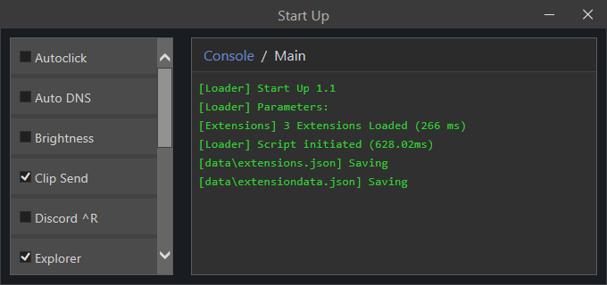

# StartUp

This is an overcomplicated project that makes AutoHotkey extensible with modules that can be enabled and disabled without restarting or modifying the code.



### Installation

Install this with [scoop](https://scoop.sh/) or download the binary from [Releases](https://github.com/thegamerx1/StartUp/releases)!

```pwsh
scoop bucket add scoop_bucket https://github.com/thegamerx1/scoop_bucket
scoop install scoop_bucket/startup
```
